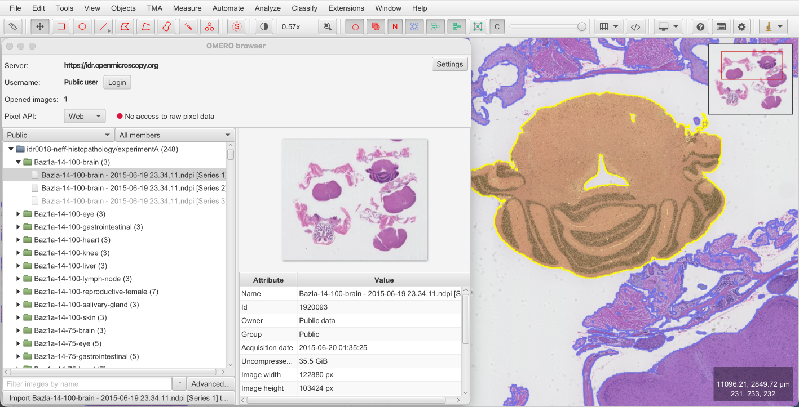

# Summary

QuPath is open-source software for bioimage analysis.
Used by labs worldwide to visualise and analyse large and complex images, QuPath is a desktop application that is primarily designed to work with images stored on a local file system - which limits scalability and collaboration.

This paper describes a new extension that enables QuPath to access pixels and metadata from an OMERO server.
This enhances the software by allowing it to work efficiently with images stored remotely, while also serving as a template for developers who want to connect QuPath to other image management systems.

# Statement of need

QuPath is a popular, open-source application for image analysis, written in JavaFX [@Bankhead2017].
With over 900,000 downloads (across all releases) and more than 6,000 paper citations to date, QuPath's support for large and complex images have helped establish the software as a key biomedical research tool.

QuPath is routinely used to analyse whole slide images, which are common in research and the field of digital pathology.
A 'small' whole slide image might be 120,000 x 60,000 pixels in size, which equates to around 20 GB uncompressed data (assuming 8-bit, 3-channel RGB pixels).
Some images used with QuPath can be much larger, such as fluorescence multiplexed whole slide images that often contain dozens of 16-bit or 32-bit channels.
While lossy compression can somewhat reduce file sizes, data management is a major issue for large studies - particularly given that QuPath is primarily a desktop application, designed to work with a local file system.

OMERO is a popular, open-source image management solution that enables images to be stored on a central server and viewed through a web browser [@Allan2012].
OMERO also supports whole slide and multiplexed images.
It is installed in institutions worldwide and is a key technology powering the Image Data Resource (IDR) [@Williams2017] - a major repository currently hosting over 400 TB published imaging data.

The QuPath OMERO extension bridges the gap between both tools - making it possible to apply QuPath analysis to images hosted in OMERO.
By efficiently accessing only the required pixels and metadata, the extension avoids the need to download and duplicate entire datasets.

# State of the field

The current work builds upon lessons learned in the development of two previous QuPath extensions that connected to OMERO.

Initially, within the QuPath development team we created the [QuPath Web OMERO extension](https://github.com/qupath/qupath-extension-omero-web).
This lightweight extension could be added to QuPath and access images through the OMERO web API.
As a single jar file without external dependencies, this was easy to install and use.
However, it had the major limitation of being able to request only JPEG-compressed, 8-bit RGB tiles - not raw pixel data.
This made it unsuitable for quantitative analysis and incapable of supporting most fluorescence images, which can have different bit-depths and channels.

The [BIOP OMERO extension](https://github.com/BIOP/qupath-extension-biop-omero) started as a fork of our original extension.
It was developed by the [BioImaging and Optics Platform (BIOP)](https://biop.epfl.ch/) team to use the OMERO Ice API, rather than the web API.
This had the major advantage of raw pixel access, but also had disadvantages: it required many additional dependencies, raw pixel access could be slow, and it supported only OMERO servers with authentication.

We developed the present QuPath OMERO extension from scratch to provide a more flexible and maintainable solution.
It aims to overcome previous limitations, while adding support for recent OMERO features and implementing best practice through extensive tests.
Key features include the ability to:

1. Browse and import images from both public and private OMERO servers.
2. Access pixels flexibly using different APIs.
3. Exchange extra information (e.g., annotated regions of interest) between QuPath and OMERO.
4. Run custom scripts within QuPath to interact with the OMERO server.

The new extension also includes extensive unit tests.
It can be easily installed through QuPath's new extension manager - which we developed in parallel to this extension, and which supports downloading both the extension and any optional dependencies.

 
# Software design

While the need for flexible pixel access from both public and private OMERO servers was the initial motivation for this work, 
we developed a new extension (rather than another fork) to avoid the constraints of earlier design choices and backwards compatibility.
This also allowed us to better separate core logic from the user interface, improve responsiveness, and add unit tests.
This separation is reflected in the code being divided into two main packages: `gui` and `core`.

The `gui` package contains the user interface controls and interaction with the main QuPath application.
It is designed to follow the general style of QuPath and to always stay responsive by delegating long-running tasks to background threads.
When browsing an OMERO server, the interface resembles the OMERO web client to facilitate user adoption.

The `core` package is largely independent of the user interface, although we permitted the use of JavaFX observable properties and some QuPath classes (e.g., to manage preferences).
This was a pragmatic decision that allowed us to write simpler code with less duplication.
The key distinction between packages is therefore that `core` contains classes that can be used headlessly and via scripts, while `gui` requires the interface to be instantiated.

The `core` package is also the focus of our unit testing.
Because many functions can only be tested when an active connection to an OMERO server is established, a Docker container that hosts an OMERO server is automatically created when unit tests are run.
The extension also provides a bash script to create this Docker container outside of the unit tests, which can be useful for manual testing.

A central part of the `core` package is support for different pixel APIs.
Three are currently implemented:

* The **web** pixel API: this is enabled by default and is available on every OMERO server. It is fast, but suffers from the same limitations as the QuPath Web OMERO extension: only RGB images can be read, and images are JPEG-compressed.
* The **Ice** pixel API: similar to the BIOP OMERO extension, this can read any image and access raw pixel values. It is available when its additional dependencies are installed. It does not support reading images when the connection to the OMERO server is not authenticated.
* The **pixel data microservice** API: this can read any image and access the raw pixel values. It works for both public and private servers, but requires that the [OMERO Pixel Data Microservice](https://github.com/glencoesoftware/omero-ms-pixel-buffer) is installed on the server.

The variety of server configurations and user requirements makes flexible support for different APIs essential.
Of the three current options, the pixel data microservice API has significant advantages, but not enough OMERO servers have installed the necessary microservice to make it a default.
Furthermore, alternatives might also become adopted in the future, such as the [OMERO Zarr Pixel Buffer](https://github.com/glencoesoftware/omero-zarr-pixel-buffer).

User instructions can be found on the OMERO page of the [QuPath documentation](https://qupath.readthedocs.io/en/stable/docs/advanced/omero.html).
We have also provided javadoc comments for all public fields and methods within the extension.
The javadocs are installed along with the extension and are available via QuPath's built-in Javadoc viewer to help users write their own scripts.

# Research impact statement

The QuPath OMERO extension was initially released on February 2024.
Since then, the extension has evolved through contributions, bugs reporting, and feature requests.

As of the beginning of March 2026, the QuPath OMERO extension has been downloaded 29,727 times.
This demonstrates a broad and active user community, which is not limited to users at institutions where images are managed using OMERO.
Because OMERO is also used by major public imaging resources, such as the IDR, the extension can help anyone access these resources and explore the data within QuPath.

# AI usage disclosure

No generative AI was used in the software creation, documentation, or paper authoring.

# Acknowledgements

This work was supported by the Wellcome Trust [223750/Z/21/Z].
This project has been made possible in part by grant number 2021-237595 from the Chan Zuckerberg Initiative DAF, an advised fund of Silicon Valley Community Foundation.

We thank Melvin Gelbard and Rémy Dornier for contributions to earlier QuPath OMERO extensions, and the BIOP team (especially Rémy) for extensive testing and feedback on the current work.

# References